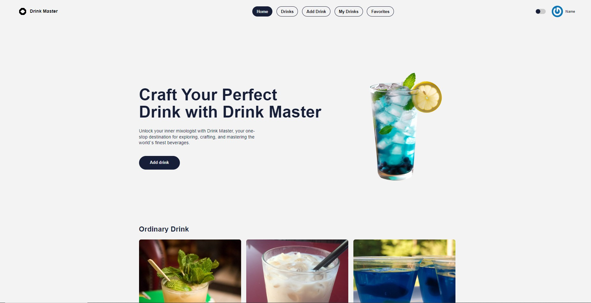
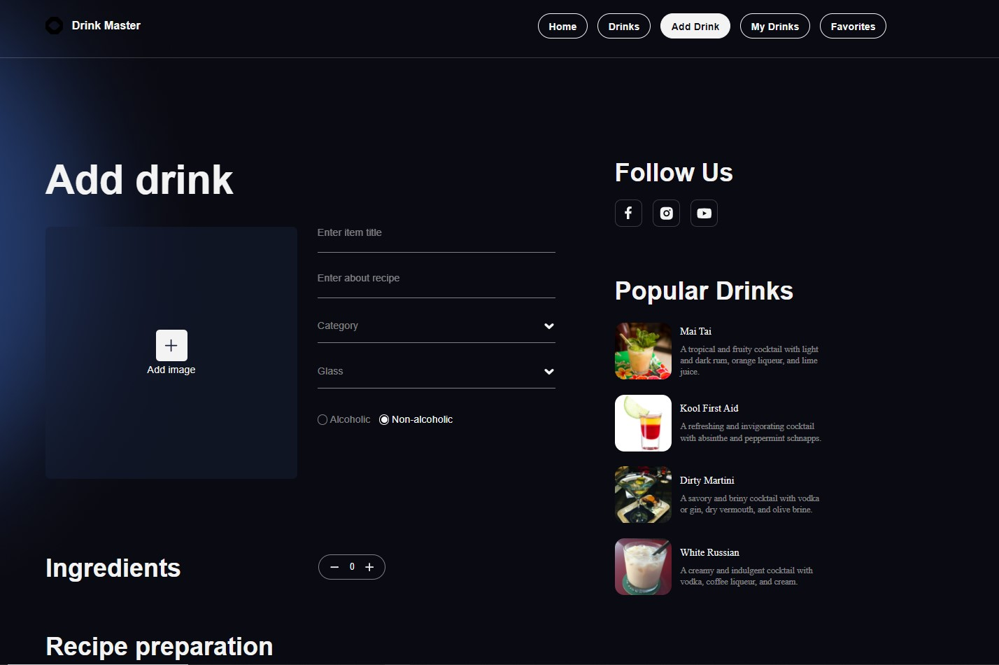
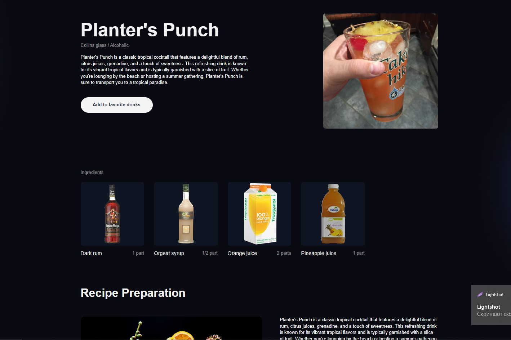
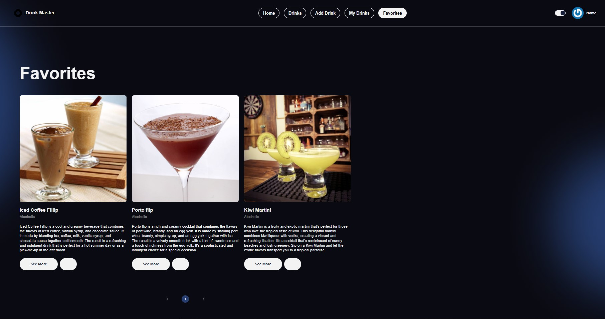

# Craft Your Perfect Drink with Drink Master:cocktail:

This site offers an attractive library of popular cocktails, organized by
category and the ingredients used to make them. Registered users can find a
drink of interest, view the recipe and its ingredients, add it to their
favorites, or write their own recipe and store it in the database. save it in
the database.

## Table of Contents

- [Technical stack](#stek)
- [Backend](#backend)
- [Features](#features)
- [Contributors](#contributors)

## <a id="stek">Technical stack</a>

## <a id="backend">Backend</a>

- [GitHub](https://github.com/Serg1853/drink_Master-React_Node-backend)
- [Swagger / API Docs](https://drink-master-project-zi2s.onrender.com/api-docs/)

## <a id="features">Features</a>

-Registration and user login with name, mail, date of birth and password.
.jpg>)
.jpg>)

-Light and dark theme.

-Add new drinks recipe to your collection.

-Adding cocktails of interest to a list of favorites.

## <a id="contributors">Contributors</a>

This project was made possible by the hard work and dedication of the following
team members:

- 👦Vladylen Korol - Team Lead Front-End/ Developer
  - [GitHub](https://github.com/iVladyuser)
  - [LinkedIn](https://www.linkedin.com/in/ivlady/)
- 👦Sergiy Topolnitskiy - Team Lead Back-End/ Developer
  - [GitHub]()
  - [LinkedIn]()
- 👧Oksana Lukashyk- Scrum Master / Developer
  - [GitHub](https://github.com/OksanaLukashyk)
  - [LinkedIn](https://www.linkedin.com/in/oksana-lukashyk-032283122/)
- 👦Markiyan Chornovil - Developer
  - [GitHub](https://github.com/MarkiyanCh1)
  - [LinkedIn](https://www.linkedin.com/in/markiyan-chornovil)
- 👧Maryna Kuturlanova - Developer
  - [GitHub](https://github.com/KuturlanovaMaryna)
  - [LinkedIn](https://www.linkedin.com/in/maryna-kuturlanova/)
- 👦Vitaliy Kalutiuk - Developer
  - [GitHub](https://github.com/Vitaliy2773)
  - [LinkedIn](https://www.linkedin.com/in/vitalii-kalutiuk-5bba20272/)
- 👧Vita Perevoznikova - Developer
  - [GitHub](https://github.com/VitaPerevoznikova)
  - [LinkedIn](www.linkedin.com/in/viita-perevoznikova)
- 👦Dmitriy Sukhorukov- Developer
  - [GitHub](https://github.com/ciplator)
  - [LinkedIn](https://www.linkedin.com/in/%D0%B4%D0%BC%D0%B8%D1%82%D1%80%D0%B8%D0%B9-%D1%81%D1%83%D1%85%D0%BE%D1%80%D1%83%D0%BA%D0%BE%D0%B2-b7428a25a/)
- 👦Vladislav Beketov - Developer
  - [GitHub](https://github.com/Vladislav-creator/)
  - [LinkedIn](https://www.linkedin.com/in/vladislav-beketov/)
- 👧Olesia Medvedeva - Developer
  - [GitHub](https://github.com/martadelka)
  - [LinkedIn](https://www.linkedin.com/in/%D0%BE%D0%BB%D0%B5%D1%81%D1%8F-%D0%BC%D0%B5%D0%B4%D0%B2%D0%B5%D0%B4%D0%B5%D0%B2%D0%B0-590940294?utm_source=share&utm_campaign=share_via&utm_content=profile&utm_medium=android_app)
- 👦Dmytro Romanets - Developer
  - [GitHub](https://github.com/DimaRomanets)
  - [LinkedIn](https://www.linkedin.com/in/dmytro-romanets/)
